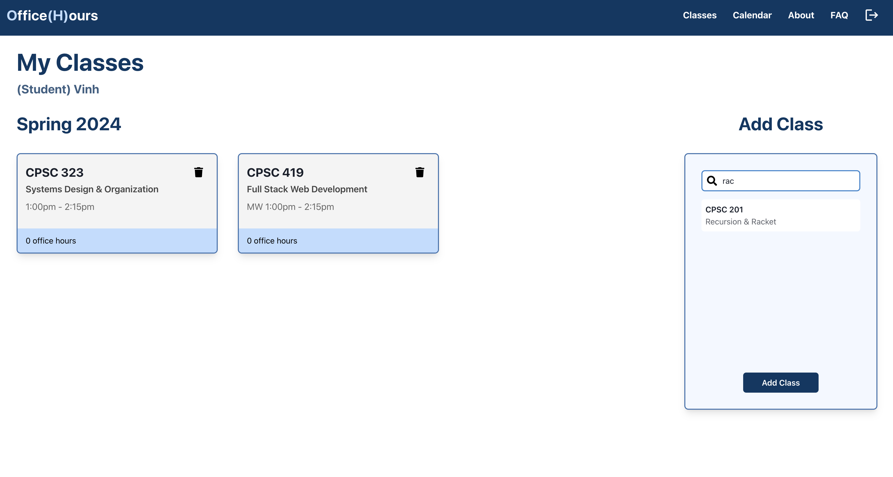
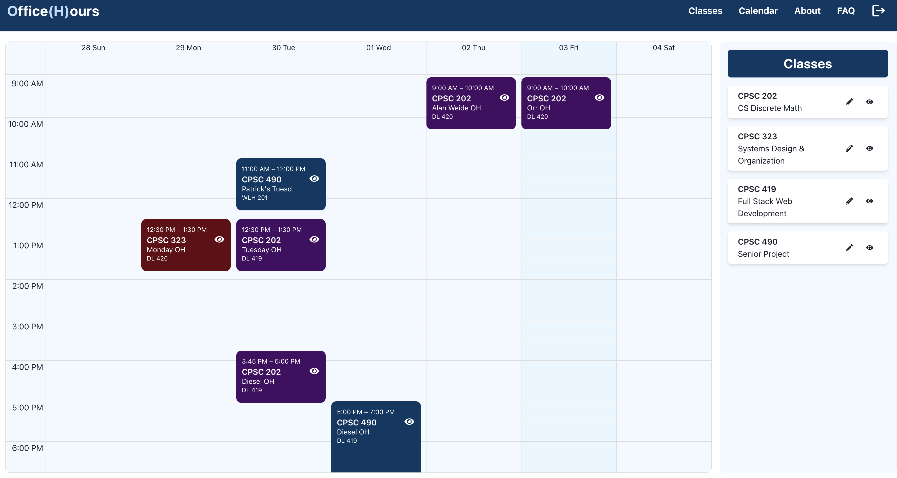
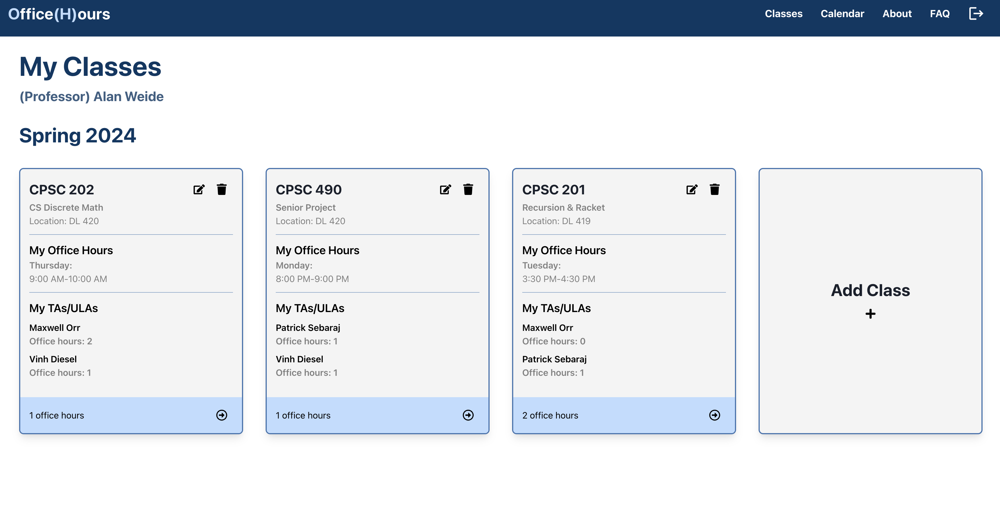
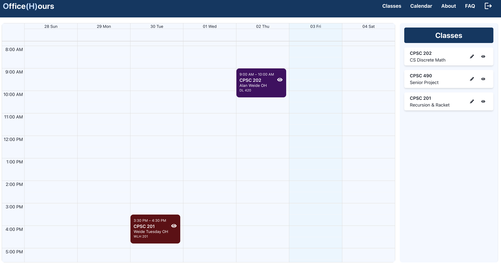
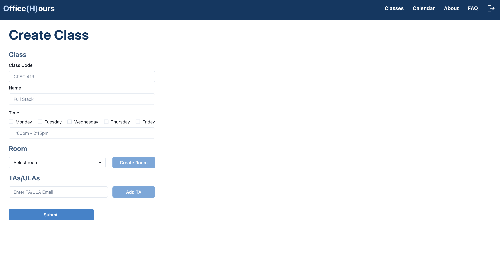
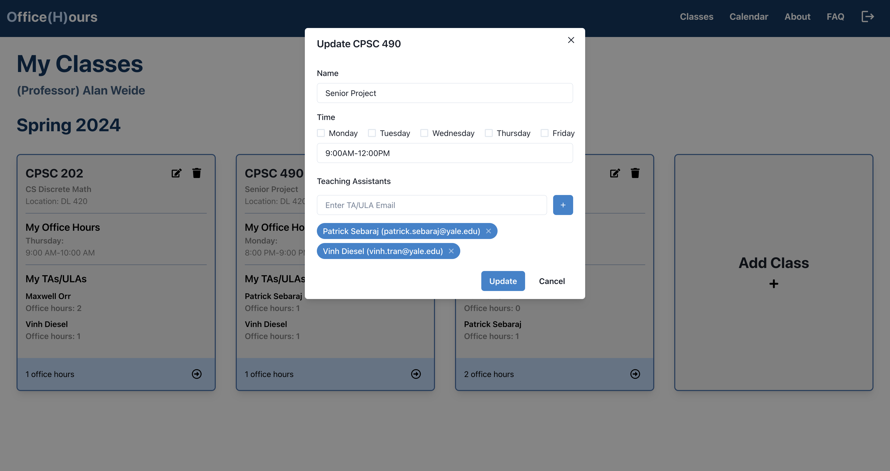
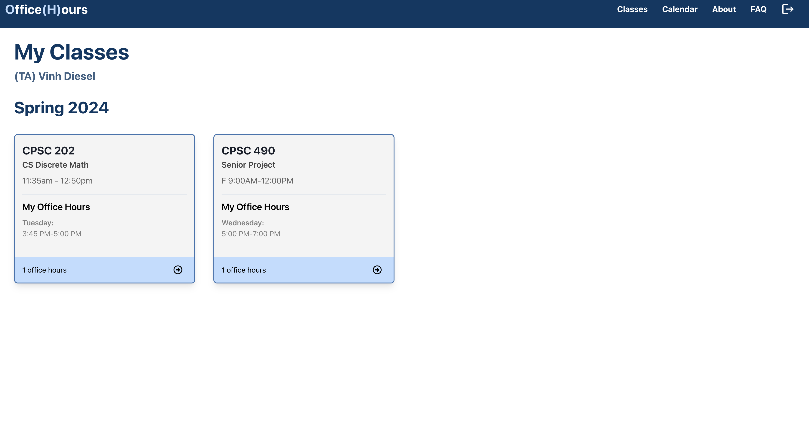
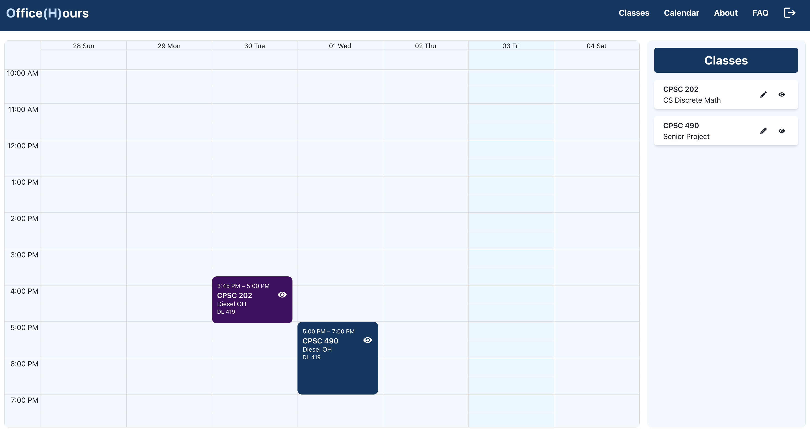

<h1 align="center">
  
  <br/>
  office hours management app
</h1>

<div align="center">
  <p>
    <strong>Final Project Assignment, CPSC419</strong>
  </p>
</div>

<h3 align="center">byHaroon,  Nikhil, Vinh </h3>

## Project Description

Currently, there is no consistent way to keep track of office hours, peer tutoring, etc. Students often take 4-6 classes, each with their own set of differing schedules. Some professors use Google Calendar, some use Google Sheets, some just display it on the Home page of Canvas, while others just put it in their syllabus. Many students input these office hours into their own calendar, an arduous process of creating 10-20 different events and the worst part is that OH are updated/canceled as the semester progresses. That means students have to continually look out for announcements, emails, etc. and physically update their own calendars to match.

O(H), or Office(H)ours, is an office hours calendar and visualizer to better organize and coordinate schedules designed with the user in mind. Rather than just being a website that displays set classes OHs, O(H) offers a more individualized way to keep track of OHs. In addition, it offers seamless communication with professors and TA/ULAs as they can update times and events on the app which will automatically update on the student's view.

## Tech Stack

- React + Redux + Chakra UI
- Flask
- PostgreSQL + AWS (pgAdmin4 + RDS)

## Folder Structure

- `backend`
  - `app.py`: flask app
  - `database.py`: database queries
  - `requirements.txt`: python packages
  - `run.py`: program to run app
- `db`
  - `create_script`: create tables for db (already hosted on AWS)
- `frontend`
  - `public`
  - `src`
    - `classes`: define class objects
    - `components`: shared components
    - `pages`
      - `About`: about page
      - `Auth`: user authentication
      - `Calendar`: calendar page
      - `Class`: professor or TA class page
      - `Create`: creating events
      - `FAQ`: FAQ page
      - `Home`: student, professor, or TA home page
    - `redux`: global state for user and events
    - `App.jsx`
    - `index.js`
  - `.env`: env variables for API and AWS urls

## How to Run

### Local

#### Frontend

To run the React app on your local machine:

```bash
# navigate to frontend
$ cd frontend
# install dependencies
$ npm install
# run react app
$ npm start
```

#### Backend

**Server**

To run the Flask server directly on your local machine (port is env variable set to 80):

```bash
# navigate to backend
$ cd backend
# install dependencies
$ pip install -r requirements.txt
# run flask app
$ python run.py
```
**Database**

We host our PostgreSQL on AWS, which is already linked to our app. In case you want to reproduce it from scratch – here are the steps:

1. First, following the instructions located [here](https://aws.amazon.com/getting-started/hands-on/create-connect-postgresql-db/) deploy a postgres db instance.
2. After deploying, connect to your db using pg admin4.
3. Then use our create_script located [here](db/create_script).

**Note: it is recommended to use a virtual environment for python**

```bash
# activate
$ python3 -m venv .venv
$ source .venv/bin/activate

# deactivate
$ deactivate
```

## Contributions

### Nikhil Ismail ('24.5, ni58)

- set up frontend skeleton and general frontend
- set up react router for navigation
- worked on authentication
- worked on calendar

### Vinh Tran ('25, vt237)

- set up backend skeleton
- designed frontend UI
- worked on student view, TA view, FAQ, and About pages
- worked on redux for storing user state

### Haroon Mohamedali ('26, hhm22)

- set up PostgreSQL DB + python connection to DB
- worked on professor view
- worked on calendar
- worked on hidden classes for calendar

## UI/UX Demo ([v0 figma design here](https://www.figma.com/file/TSaiytXbBwi5lgdekpF6Sw/O(H)-App?type=design&node-id=0%3A1&mode=design&t=2Pk2q2PRqZGBqYvp-1))

### Student View



### Professor View





### TA/ULA View



